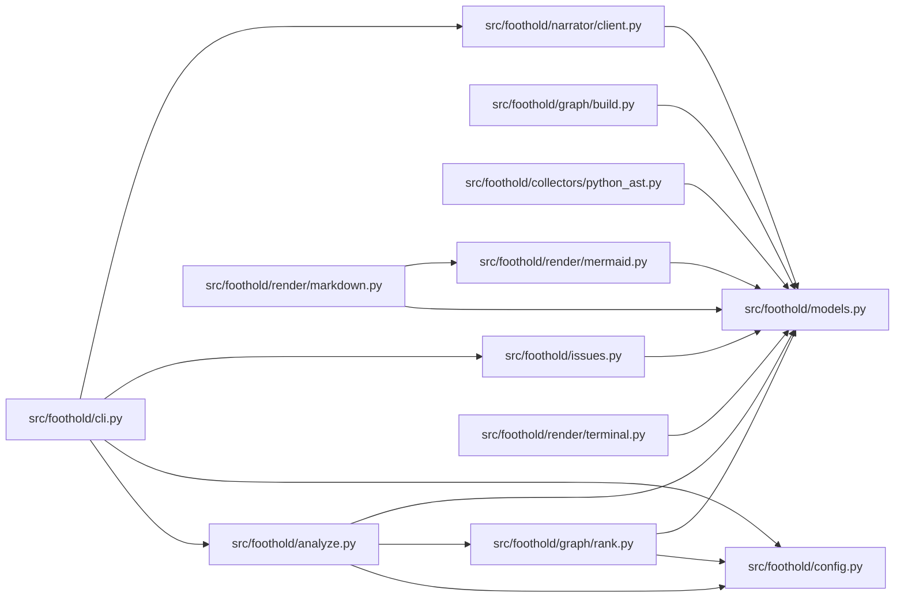

# Architecture

<!-- Generated by foothold. Re-run `foothold docs` to refresh. -->

31 modules (19 source), 1,298 lines, 202 import statements.

## Where to start

## Core modules

| File | Score | Imported by | Lines | Signals |
|---|---:|---:|---:|---|
| `src/foothold/models.py` | 0.678 | 10 | 71 | imported by 10 modules, high transitive reach |
| `src/foothold/config.py` | 0.185 | 5 | 71 | — |
| `src/foothold/narrator/client.py` | 0.168 | 3 | 86 | — |
| `src/foothold/graph/build.py` | 0.153 | 3 | 80 | — |
| `src/foothold/collectors/python_ast.py` | 0.145 | 3 | 109 | — |
| `src/foothold/graph/rank.py` | 0.145 | 3 | 118 | — |
| `src/foothold/cli.py` | 0.124 | 1 | 152 | — |
| `src/foothold/analyze.py` | 0.106 | 3 | 41 | — |
| `src/foothold/issues.py` | 0.101 | 2 | 72 | — |
| `src/foothold/render/mermaid.py` | 0.096 | 2 | 25 | — |
| `src/foothold/render/markdown.py` | 0.081 | 1 | 58 | — |
| `src/foothold/render/terminal.py` | 0.076 | 1 | 48 | — |
| `src/foothold/collectors/git_history.py` | 0.071 | 1 | 44 | — |
| `src/foothold/collectors/markers.py` | 0.062 | 1 | 32 | — |
| `src/foothold/render/__init__.py` | 0.039 | 2 | 6 | — |
| `src/foothold/collectors/__init__.py` | 0.015 | 1 | 6 | — |
| `src/foothold/graph/__init__.py` | 0.011 | 1 | 5 | — |
| `src/foothold/narrator/__init__.py` | 0.003 | 1 | 4 | — |
| `src/foothold/__init__.py` | 0.000 | 1 | 4 | — |

## Dependency graph

## How this file is scored

`score = 0.45·pagerank + 0.30·churn + 0.15·fan-in + 0.10·log(loc)`, each term min-max normalised across the repository. Weights are configurable in `.foothold.toml`.
